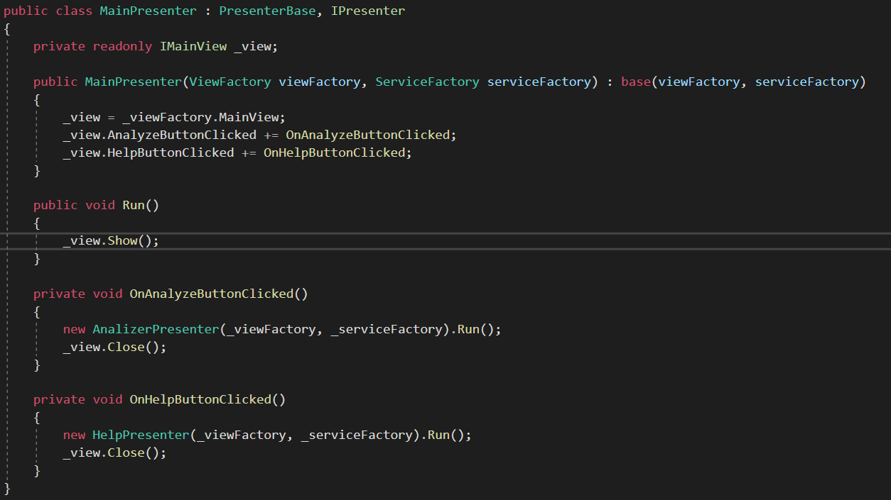
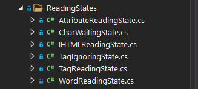

HTMLWordCounter
===============

Решение задание отборочного тура цифровой олимпиады Волга-IT-XXI по дисциплине
прикладное программирование.

Использование
-------------

Программа состоит из 4-х форм:

1.  Главная форма - позволяет начать работу или узнать больше о программе

2.  Форма анализа - позволяет выбрать файл для анализа и выставить необходимые
    параметры

3.  Форма ожидания - сообщает пользователю о том, когда анализ будет закончен, а
    также позволяет открыть файл, если анализ уже выполнен

4.  Форма справки - содержит краткое описание программы

 

Чаще всего вы будете видетб форму анализа. Она выглядит так:

-   Параметр “Учитывать регистр” позволяет определить, считается ли то же слово,
    написанное большими буквами за отделеное или нет. Например слова
    “Разработка” и “разработка” будут считаться за разные, если параметр
    включен.

-   Параметр “Максимальная штатная длина слова” позволяет установить, слово
    какого размеры будет рассматриваться как ошибка синтаксиса. Например, если
    максимальная длина слова = 5, то слово “разработка” будет считаться за
    ошибку.

-   Параметр “Игнорируемые теги” позволяет задать теги, слова, в которых будут
    игнорироваться. Это особенно полезно для таких тегов, как style и script.
    Чтобы добавить тег в список, напишите его название в строку, находящуюся над
    кнопкой “Добавить” и нажмите эту кнопку. Чтобы удалить тег из списка нажмите
    на его название в меню слева. ВАЖНО: Не следует добавлять в этот список
    теги, которые не будут закрыть до конца файла, например тег meta. Это не
    имеет смысла, т.к тег не содержит слов внутри себя и парсер выдаст ошибку.
    Такие теги, как \<br/\> будут работать, т.к указан знак закрытия тега,
    однако добавлять их тоже не рекомендуется.

-   Нажатие на кнопку обзор позволяет выбрать место, в которое будет сохранен
    проанализированный файл.

-   Нажав кнопку “Анализировать” вы увидете диалог выбора файла для анализа. В
    этом диалоге можно отфильтровать файлы по типу \*.html и \*.txt

Когда анализ будет окончен, вы увидете следующую форму:

-   Кнопка “Открыть файл” открывает результирующий файл в программе по
    умолчанию. Например, “Блокнот”или “Sublime Text”

-   Кнопка “Анализировать снова” вернет вас на форму анализа

 

Архитектура
-----------

Приложение построено на базе фреймворка “Windows Forms” и использует
архитектурный паттерн MVP (Model-View-Presenter) в своей основе.

Приложение разбито на 4 сборки:

-   Сборка VolgaIT.BL хранит в себе абстракцию и реализацию бизнес-логики
    приложения

-   Сборка VolgaIT.Presenters хранит в себе реализацию презентеров для каждой из
    форм

-   Сборка VolgaIT.Views хранит абстракцию для представлений

-   Сброка VolgaIT содержит реализацию представлений с помощью форм “Windows
    Forms”, а также инициализирует запускаемое приложение

 

### Presenters

Каждый презентер при инициализации требует фабрику для представлений и сервисов
(элементов, необходимых для выполнения бизнес-логики)

 

Таким образом выглядит инициализация главного презентера в методе Main:

При создании презентер получает необходимые сервисы и представления из фабрик, а
также подписывается на их события.

Так выглядит простой презентер для главной формы:

Как видно из этого примера презентеры сами создают друг друга, получая от
пользователя необходимую информацию, например, нажатие кнопки. Нажатие кнопки
также может вызвать и выполнение бизнес-логики, если это указано в презентере.

### Views

Все представления в приложении должны реализовывать интерфейс IView.

Он задает все необходимые параметры для работы с представлением.

 

А вот пример интерфейса для формы анализа, через него работает класс
AnalyzerPresenter

Реализация же этого представления привязывает свойства к элементам управления на
форме, а события указанные в интерфейсе срабатывают при нажатии соответствующих
кнопок.

Model
-----

Главная часть бизнес-логики содержится в интерфейсе IWordCountService

Он предоставляет методы для анализа файла, а также позволяет задать определенные
параметры, например, игнорируемые теги.

Свойство WordSaver позволяет прочитать или установить, то, как именно сервис
подсчета слов будет сохранять результаты анализа.

Класс FileWordSaver - используемая в программе реализация IWordSaver. Она
позволяет сохранить слова в файл по указанному заранее пути в формате -
\<Слово\> - \<количество слов\>. Другая возможная реализация могла бы сохранять
результат анализа в базу данный или даже на удаленный сервер. Все что нужно для
замены - создать новый IWordSaver в методе Main, как было показано выше.

Реализация IWordCountService, используемая в программе является примером
паттерна “Состояние”. Класс WordCountService создает файловый поток, а его
чтение поручает одному из своих состояний:

Каждой из перечисленных состояний посимвольно читают из файла и могут перейти в
другое состояние или выполнить определенное действие, проанализировав полученные
значения. Например, WordReadingState посимвольно считывает слова и сохраняет их
при встрече символов из списка разделителей, а если встречают символ “\<”, то
переходит в TagReadingState.

 

Одной из важных частей бизнес-логики также является интерфейс
IWordCounterConfigurator и его JSON реализация JSONWordCounterConfigurator. Он
позволяет сконфигурировать IWordCounterService с помощью сериализуемого в JSON
класса WordCounterConfig. И, таким образом, сохранить/восстановить конфиг в/из
JSON файла.

